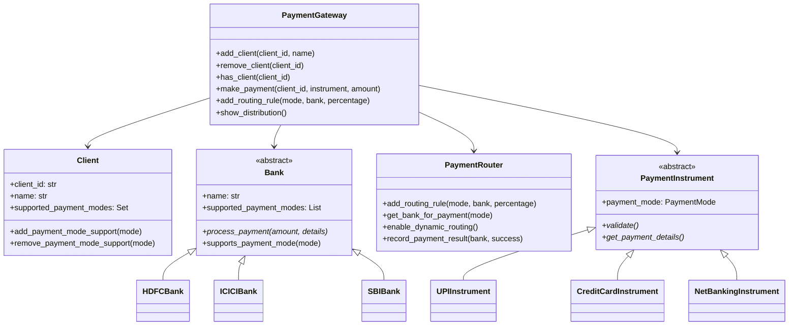

# Payment Gateway System - Low Level Design

A comprehensive payment gateway system implementation that demonstrates object-oriented design principles, separation of concerns, and extensible architecture.

## Raw Problem Statement
Payments is an integral component of any e-commerce or fintech.
With the advent of digital india, we have seen different types of payments ecosystem rising up - Payments gateways, UPI, Rupay Network etc. These are easy to integrate and any org can get started with this in a matter of days.

With the onset of different payment players, organizations integrate different payment gateways and shuffle between them to suit their use cases best.

Based on use cases, customers can opt for payment via card / upi / net banking etc. Below is the general runbook for making a payment.

Select a pay mode
Enter details
For netbanking - enter username and password
For credit / debit card - enter card details ( number, expiry, cvv etc )
UPI - enter vpa
Implement a payments gateway which help facilitate a payment for its client, below points should be kept in mind while implementation

Real world example

Flipkart has integrated multiple PGs like Razorpay, Citrus, PaySafe, CCAvenue etc. They use these PGs based on different use cases. For example, divert all credit card transaction to RazorPay while Netbanking goes to CCAvenue.

These PGs internally have direct integration with different banks which facilitate the payments.

Expectation from this code is to build PG like a Razorpay / CCAvenue which allows onboarding clients like Flipkart and process a transaction.

Client in this case is Flipkart ( PG can have more than one clients )
PG is what candidate has to implement
PG can have more than one bank, candidates are free to implement a mock or full fledged class

Feature Requirement:

PG should support onboarding multiple clients.
PG should have multiple bank integrations ( like HDFC, ICICI, SBI etc )
PG should have facility to support different payment methods - UPI, Credit / Debit Card, Netbanking etc
PG should have facility to divert to specific bank based on certain criteria - a router basically - (for e.g. all credit card transaction goes to HDFC and netbanking is redirected to ICICI )
PG should have facility to allocate specific percentage between different banks - say bank1 takes 30% of total traffic while remaining 70% go to bank2
Clients should have an option to opt for specific payment methods. - only UPI, everything except netbanking etc
Assumptions:

Banks can randomly return success / failure - candidates can create a random function to mock this behaviour.
Payments should be processed using an instrument only if specific parameter for that payment is passed - netbanking might need user id / password but credit card will only work with card details
Banks require OTP verification after instrument details are verified ( applicable for netbanking / card transaction ) for sake of simplicity, transactions will go through without OTP.
Code Expectation:

Everything has to be in memory.
Candidate can opt for any language for implementation
Simple and basic function are expected as entry point - no marks for providing fancy restful API or framework implementation
Because this is a machine coding round, heavy focus would be given on code quality, candidate should not focus too much time on algo which compromises with implementation time
Requirements - below are various functions that should be supported with necessary parameters passed

addClient() - add a client in PG
removeClient() - remove client from PG
hasClient() - does a client exist in the PG?
listSupportedPaymodes() - show paymodes support by PG. if a client is passed as parameter, all supported paymodes for the clients should be shown.
addSupportForPaymode() - add paymodes support in the PG. If a client is passed as parameter, add paymode for the clients.
removePaymode() - remove paymode ( both from PG or client basis parameter)
showDistribution() - show active distribution percentage of router
makePayment( //necessary payment details )
Evaluation criteria:

Working code
Code readability
Implementation of OOPs / OOD principles with proper Separation of concerns
Testability - a TDD approach ( not to be mixed with test cases )
Language proficiency
Test Cases ( bonus points )
Extension problem:

Can a router dynamically switch the traffic basis success percentage of Bank?
[execution time limit] 3 seconds (java)

[memory limit] 1 GB

## 🏗️ System Architecture

### Overview
This payment gateway system is designed to handle multiple clients (like Flipkart, Amazon), multiple banks (HDFC, ICICI, SBI, Axis), and various payment modes (UPI, Credit Card, Debit Card, Net Banking) with intelligent routing capabilities.

### Core Components

```
┌─────────────────┐    ┌─────────────────┐    ┌─────────────────┐
│   Client Layer  │    │  Gateway Layer  │    │   Bank Layer    │
│                 │    │                 │    │                 │
│  ┌───────────┐  │    │ ┌─────────────┐ │    │ ┌─────────────┐ │
│  │ Flipkart  │  │    │ │   Payment   │ │    │ │ HDFC Bank   │ │
│  │  Amazon   │  │◄───┤ │   Gateway   │ ├────┤ │ ICICI Bank  │ │
│  │  Paytm    │  │    │ │             │ │    │ │ SBI Bank    │ │
│  └───────────┘  │    │ └─────────────┘ │    │ │ Axis Bank   │ │
└─────────────────┘    └─────────────────┘    │ └─────────────┘ │
                                              └─────────────────┘
```

## 🔧 Key Features Implemented

### 1. **Multi-Client Support**
- ✅ Add/Remove clients dynamically
- ✅ Client-specific payment mode restrictions
- ✅ Client activation/deactivation
- ✅ Client existence validation

### 2. **Multi-Bank Integration**
- ✅ Support for multiple banks (HDFC, ICICI, SBI, Axis)
- ✅ Bank-specific payment mode support
- ✅ Mock payment processing with random success/failure
- ✅ Extensible bank interface for easy addition of new banks

### 3. **Payment Mode Support**
- ✅ UPI (Virtual Payment Address)
- ✅ Credit Card (Card details validation)
- ✅ Debit Card (Card details validation)
- ✅ Net Banking (Username/Password authentication)

### 4. **Intelligent Routing System**
- ✅ Percentage-based traffic distribution
- ✅ Payment mode specific routing rules
- ✅ Dynamic routing based on bank success rates
- ✅ Routing rule validation (total percentage ≤ 100%)

### 5. **Advanced Features**
- ✅ Dynamic routing with success rate tracking
- ✅ Comprehensive error handling
- ✅ Payment instrument validation
- ✅ Transaction tracking and reporting

## 📁 Project Structure

```
payment-gateway/
├── payment_mode.py         # Payment instruments and enums
├── bank.py                # Bank implementations and interfaces
├── client.py              # Client management
├── payment_router.py      # Routing logic and rules
├── payment_gateway.py     # Main gateway orchestration
├── demo.py               # Demonstration and usage examples
├── test_payment_gateway.py # Comprehensive test suite
└── README.md             # This file
```

## 🎯 Design Patterns Used

### 1. **Strategy Pattern**
- Different payment processing strategies for each bank
- Interchangeable routing strategies (static vs dynamic)

### 2. **Factory Pattern**
- Bank creation and management
- Payment instrument creation

### 3. **Template Method Pattern**
- Base Bank class with common payment processing flow
- Specific implementation in derived bank classes

### 4. **Observer Pattern** (Implicit)
- Router tracking bank success rates
- Dynamic adjustment based on performance

## 🔍 Class Diagram



## 🚀 Getting Started

### Prerequisites
- Python 3.7+
- No external dependencies required (uses only standard library)

### Running the Demo
```bash
cd payment-gateway
python demo.py
```

### Running Tests
```bash
python test_payment_gateway.py
```

## 📋 API Usage Examples

### 1. Basic Setup
```python
from payment_gateway import PaymentGateway
from bank import HDFCBank, ICICIBank
from payment_mode import PaymentMode, UPIInstrument

# Initialize gateway
pg = PaymentGateway("MyPaymentGateway")

# Add banks
pg.add_bank(HDFCBank())
pg.add_bank(ICICIBank())

# Add payment mode support
pg.add_support_for_paymode(PaymentMode.UPI)

# Add client
pg.add_client("FLIPKART", "Flipkart", {PaymentMode.UPI})
```

### 2. Setting Up Routing Rules
```python
# Route 70% UPI traffic to HDFC, 30% to ICICI
pg.add_routing_rule(PaymentMode.UPI, "HDFC", 70.0)
pg.add_routing_rule(PaymentMode.UPI, "ICICI", 30.0)

# View current distribution
pg.show_distribution()
```

### 3. Processing Payments
```python
# Create payment instrument
upi_payment = UPIInstrument("customer@paytm")

# Process payment
result = pg.make_payment("FLIPKART", upi_payment, 1000.0)

if result.success:
    print(f"Payment successful: {result.transaction_id}")
else:
    print(f"Payment failed: {result.error_message}")
```

### 4. Dynamic Routing
```python
# Enable dynamic routing based on success rates
pg.enable_dynamic_routing()

# Router will automatically prioritize banks with better success rates
```

## 🎯 Business Logic Implementation

### Payment Processing Flow
1. **Validate Client** - Check if client exists and is active
2. **Validate Payment Mode** - Ensure both gateway and client support the payment mode
3. **Validate Payment Instrument** - Check instrument details (VPA format, card details, etc.)
4. **Route to Bank** - Use routing rules to select appropriate bank
5. **Process Payment** - Forward to selected bank for processing
6. **Record Result** - Track success/failure for dynamic routing

### Routing Logic
- **Static Routing**: Percentage-based distribution among banks
- **Dynamic Routing**: Adjusts routing based on historical success rates
- **Fallback Mechanism**: Ensures payment attempts even if preferred banks fail

## 🧪 Test Coverage

The test suite covers:
- ✅ Payment instrument validation (all types)
- ✅ Client management operations
- ✅ Bank processing logic
- ✅ Routing rule management
- ✅ Gateway orchestration
- ✅ Error scenarios and edge cases
- ✅ Integration testing
- ✅ Dynamic routing functionality

### Test Statistics
- **Total Test Cases**: 25+
- **Coverage Areas**: All major components
- **Test Types**: Unit, Integration, Error scenarios

## 🔒 Security Considerations

### Implemented Security Measures
- **Data Sanitization**: Card numbers masked in payment details
- **Password Protection**: Passwords excluded from payment details
- **Input Validation**: Comprehensive validation for all payment instruments
- **Error Handling**: Secure error messages without sensitive data exposure

## 🚀 Extensibility

### Adding New Banks
```python
class NewBank(Bank):
    def __init__(self):
        super().__init__("NEW_BANK", [PaymentMode.UPI, PaymentMode.CREDIT_CARD])
    
    def process_payment(self, amount, payment_details):
        # Implement bank-specific logic
        pass
```

### Adding New Payment Modes
```python
class WalletInstrument(PaymentInstrument):
    def __init__(self, wallet_id, pin):
        super().__init__(PaymentMode.WALLET)
        self.wallet_id = wallet_id
        self.pin = pin
    
    def validate(self):
        return len(self.wallet_id) > 0 and len(self.pin) == 4
```

## 📊 Performance Considerations

### Optimizations Implemented
- **In-Memory Storage**: Fast data access for all operations
- **Efficient Routing**: O(1) average case for bank selection
- **Limited History**: Only last 100 transactions stored for dynamic routing
- **Lazy Evaluation**: Routing decisions made only when needed

## 🎛️ Configuration Options

### Gateway Configuration
- **Dynamic Routing**: Enable/disable success rate based routing
- **Success History**: Configurable history size for performance tracking
- **Routing Percentages**: Flexible percentage allocation per payment mode
- **Client Restrictions**: Per-client payment mode limitations

## 🤝 Extension Problems Solved

### Dynamic Traffic Switching
✅ **Implemented**: Router can dynamically switch traffic based on bank success percentages
- Tracks success/failure history for each bank
- Automatically prioritizes high-performing banks
- Maintains percentage distribution while considering performance
- Configurable history window for adaptive behavior

## 📈 Future Enhancements

### Potential Improvements
- **Database Integration**: Persistent storage for production use
- **Real-time Monitoring**: Live dashboard for payment analytics
- **Load Balancing**: Advanced algorithms for traffic distribution
- **Fraud Detection**: ML-based transaction risk assessment
- **API Gateway**: RESTful API interface for client integration
- **Webhook Support**: Real-time payment status notifications

## 🏆 Code Quality Features

### Design Principles Followed
- **SOLID Principles**: Single responsibility, Open/closed, Interface segregation
- **DRY (Don't Repeat Yourself)**: Common functionality abstracted
- **Clean Code**: Readable, maintainable, and well-documented code
- **Separation of Concerns**: Each class has a specific, well-defined purpose
- **Testability**: Comprehensive test coverage with mock support

### Best Practices Implemented
- **Type Hints**: Full type annotation for better code clarity
- **Error Handling**: Comprehensive exception handling and validation
- **Documentation**: Detailed docstrings and comments
- **Logging**: Informative console output for operations
- **Modularity**: Loosely coupled, highly cohesive components

## 📝 Requirements Compliance

✅ All specified requirements implemented:
- Multi-client support with onboarding/removal
- Multi-bank integration with mock processing
- Multiple payment method support
- Intelligent routing with percentage distribution
- Client-specific payment mode restrictions
- Dynamic routing based on success rates
- In-memory storage
- Comprehensive test suite
- Clean, readable, and extensible code

---

**Note**: This is a low-level design implementation for educational purposes. For production use, additional considerations like security, scalability, database integration, and compliance requirements would need to be addressed.